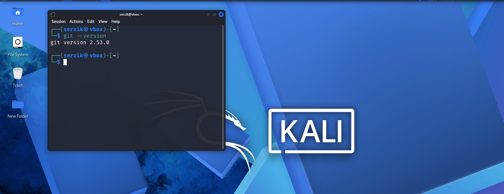
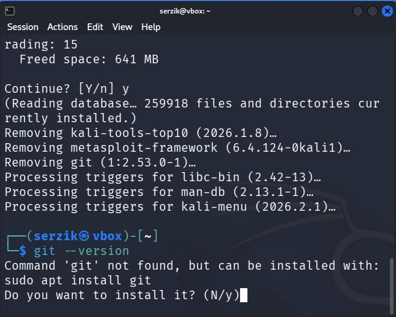
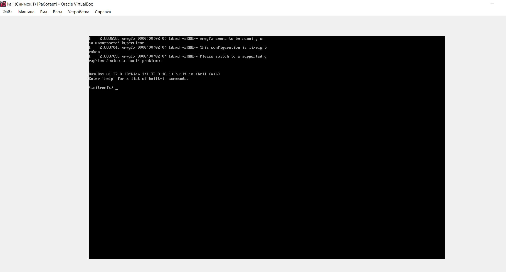
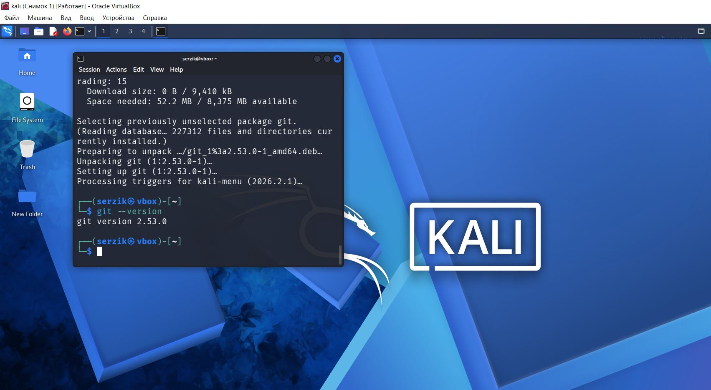

***1) Создана новая ВМ с пользователем serzik + установлен git.***

***2) Удалил GIT и снова установил***

***3)  листинги выполнения всех команд по манипуляции с файлами (touch, cat, nano, pwd, ls, head, tail, less, tree, mkdir, rm, rmdir) с различными параметрами (если они есть у данной команды).***   

Показать текущую директорию.
**pwd**

Пример вывода: `/home/user/documents`.

Простой список файлов.
**ls**

Скрытые файлы (начинающиеся с точки).
**ls -a**

Подробная информация (права, владелец, размер, дата).
**ls -l**

Человекочитаемый размер файлов (K, M, G).
**ls -lh**

Сортировка по времени изменения (новые сверху).
**ls -lt**

Обратная сортировка по времени (старые сверху).
**ls -ltr**

Рекурсивный показ всех поддиректорий.
**ls -R**

Только директории.
**ls -d */**

Комбинирование параметров.
**ls -la**

Комбинирование параметров.
**ls -lha**

Перейти в домашнюю директорию.
**cd ~**

Перейти в домашнюю директорию (альтернатива).
**cd**

Перейти в конкретную директорию.
**cd /home/user/documents**

Перейти на уровень выше.
**cd ..**

Вернуться в предыдущую директорию.
**cd -**

Перейти в корневую директорию.
**cd /**

Создать пустой файл.
**touch file.txt**

Создать несколько файлов.
**touch file1.txt file2.txt file3.txt**

Создать файл с пробелами в имени.
**touch "my file.txt"**

Создать файл с пробелами в имени (экранирование).
**touch my\ file.txt**

Обновить время доступа и модификации существующего файла.
**touch existing_file.txt**

Создать файл с указанной временной меткой.
**touch -t 202501011200 file.txt**

Создать файл, не меняя время доступа (только модификации).
**touch -m file.txt**

Просмотреть содержимое файла.
**cat file.txt**

Просмотреть несколько файлов.
**cat file1.txt file2.txt**

Объединить файлы в новый.
**cat file1.txt file2.txt > combined.txt**

Добавить содержимое в конец файла.
**cat file2.txt >> file1.txt**

Пронумеровать строки при выводе.
**cat -n file.txt**

Показать непечатаемые символы (табуляции, концы строк).
**cat -A file.txt**

Создать файл с вводом с клавиатуры (Ctrl+D для сохранения).
**cat > newfile.txt**

Открыть файл в nano.
**nano file.txt**

Открыть файл, создав его, если не существует.
**nano newfile.txt**

Открыть с указанием номера строки.
**nano +10 file.txt**

Открыть с резервным копированием.
**nano -B file.txt**

Открыть с отключением переноса строк.
**nano -w file.txt**

Сочетания клавиш в nano: Ctrl+O сохранить, Ctrl+X выйти, Ctrl+W поиск, Ctrl+K вырезать строку.

Показать первые 10 строк (по умолчанию).
**head file.txt**

Показать первые N строк.
**head -n 20 file.txt**

Показать первые 5 строк.
**head -5 file.txt**

Показать все строки, кроме последних N.
**head -n -15 file.txt**

Показать первые байты файла.
**head -c 100 file.txt**

Показать несколько файлов.
**head -n 5 file1.txt file2.txt**

Показать последние 10 строк (по умолчанию).
**tail file.txt**

Показать последние N строк.
**tail -n 20 file.txt**

Показать последние N строк (альтернатива).
**tail -20 file.txt**

Показать всё, кроме первых N строк.
**tail -n +15 file.txt**

Показать последние байты файла.
**tail -c 100 file.txt**

Следить за файлом в реальном времени (логи).
**tail -f logfile.log**

Следить с интервалом обновления (секунды).
**tail -f -s 2 logfile.log**

Показать несколько файлов.
**tail -n 5 file1.txt file2.txt**

`less` — постраничный просмотр файлов.

Открыть файл в less.
**less file.txt**

Открыть с указанием номера строки.
**less +10 file.txt**

Показать номера строк.
**less -N file.txt**

Открыть несколько файлов.
**less file1.txt file2.txt**

Просмотр вывода другой команды.
**cat file.txt | less**

Просмотр вывода другой команды.
**ps aux | less**

Внутри less: пробел/PageDown следующая страница, PageUp предыдущая, `/слово` поиск вперед, `?слово` поиск назад, `q` выход.

`tree` — показать структуру директорий.

Установка tree (Debian/Ubuntu).
**sudo apt install tree**

Установка tree (Fedora).
**sudo dnf install tree**

Установка tree (Arch).
**sudo pacman -S tree**

Показать структуру текущей директории.
**tree**

Показать структуру указанной директории.
**tree /home/user**

Показать скрытые файлы.
**tree -a**

Показать только директории.
**tree -d**

Показать человекочитаемые размеры файлов.
**tree -h**

Ограничить глубину отображения.
**tree -L 2**

Показать файлы с определенным шаблоном.
**tree -P "*.txt"**

Исключить определенные файлы.
**tree -I "*.log"**

Вывести в файл.
**tree -o structure.txt**

`mkdir` (Make Directory) — создать директорию.

Создать директорию.
**mkdir newdir**

Создать несколько директорий.
**mkdir dir1 dir2 dir3**

Создать вложенные директории (родительские создаются автоматически).
**mkdir -p path/to/nested/directory**

Создать с определенными правами доступа.
**mkdir -m 755 newdir**

Создать директорию с пробелами.
**mkdir "my directory"**

Создать директорию с пробелами (экранирование).
**mkdir my\ directory**

Показать подробности создания.
**mkdir -v newdir**

`rm` (Remove) — удалить файлы и директории.

Удалить файл.
**rm file.txt**

Удалить несколько файлов.
**rm file1.txt file2.txt file3.txt**

Удалить с подтверждением каждого файла.
**rm -i file.txt**

Принудительное удаление (без подтверждения, игнорировать ошибки).
**rm -f file.txt**

Удалить директорию с содержимым (рекурсивно).
**rm -r directory**

Принудительно удалить директорию с содержимым.
**rm -rf directory**

Удалить все файлы с определенным расширением.
**rm *.txt**

Удалить файлы с подробным выводом.
**rm -v file.txt**

Комбинирование параметров.
**rm -rfv directory**

`rmdir` (Remove Directory) — удалить пустые директории.

Удалить пустую директорию.
**rmdir emptydir**

Удалить несколько пустых директорий.
**rmdir dir1 dir2 dir3**

Удалить пустые вложенные директории.
**rmdir -p path/to/empty/directory**

Попытка удалить непустую директорию (выдаст ошибку).
**rmdir nonemptydir**

Примечание: для удаления непустых директорий используется `rm -r`.

`cp` (Copy) — копирование файлов и директорий.

Скопировать файл.
**cp source.txt dest.txt**

Скопировать файл в другую директорию.
**cp file.txt /path/to/directory/**

Скопировать несколько файлов в директорию.
**cp file1.txt file2.txt file3.txt /destination/**

Скопировать директорию рекурсивно.
**cp -r source_dir/ dest_dir/**

Копировать с сохранением атрибутов (права, время).
**cp -p file.txt dest.txt**

Копировать с подробным выводом.
**cp -v file.txt dest.txt**

Копировать без подтверждения перезаписи.
**cp -f file.txt dest.txt**

Интерактивное копирование (спросить перед перезаписью).
**cp -i file.txt dest.txt**

Создать ссылку вместо копирования.
**cp -l file.txt link.txt**

Архивировать (сохранить структуру директорий).
**cp -r --parents source/path/file.txt dest/**

`mv` (Move) — перемещение и переименование.

Переименовать файл.
**mv oldname.txt newname.txt**

Переместить файл в другую директорию.
**mv file.txt /path/to/directory/**

Переместить несколько файлов.
**mv file1.txt file2.txt file3.txt /destination/**

Переместить директорию.
**mv sourcedir/ destdir/**

Интерактивное перемещение (спросить перед перезаписью).
**mv -i file.txt dest.txt**

Принудительное перемещение (без подтверждения).
**mv -f file.txt dest.txt**

Переместить с подробным выводом.
**mv -v file.txt dest.txt**

Не перезаписывать существующие файлы.
**mv -n file.txt dest.txt**

Обновлять: перемещать только если исходник новее.
**mv -u file.txt dest.txt**

***4) сломал систему *** 

***Восстановление системы *** 

